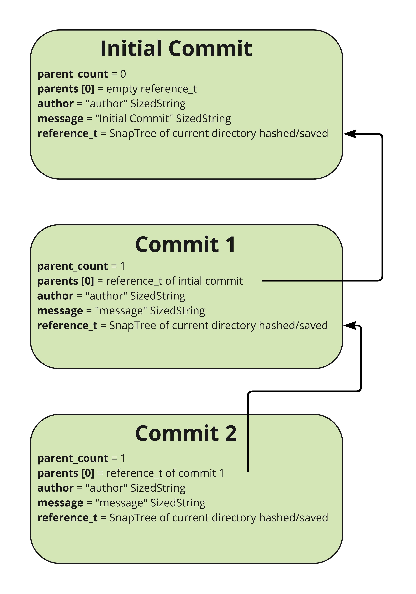
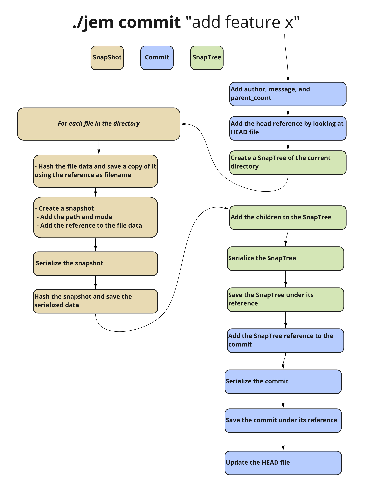
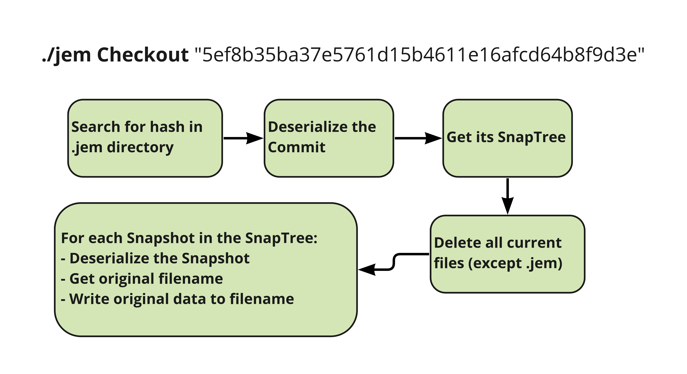

# JEM Version Control
Our goal was to make a git-like version control system. We hope to extend this MVP to add a way for multiple people to work on a repository, similar to GitHub. Our lower bound was to create a software that allows us to create repositories and create commits on that repository, saving progress along the way. Our stretch goals were to add more advanced features in git such as branches and merging. We also wanted to add a way to sync repositories across a network.
## Project Learning Goals ##
#### Jonas
"I want to learn more about how git works and why it is such a widely used version control system. I also want to work on my overall C development skills such as creating make files, using libraries, and networking."
#### Miles
"I want to learn more about how Git optimizes for storage space while still maintaining the existence of every previous version of a document. I would love to discover exactly how this is done. I also want to work with sockets and understand internet connections on a more fundamental level."
#### Elvis
"I want to learn more about low level network programming and how to write robust networked programs that can deal with loss of connection and other errors. I also hope to build the skills necessary to effectively develop c software on a team and take advantage of git and make effectively to do so. I would like to improve my ability to test c programs thoroughly and especially consider how to do this best around networking code and distributed systems."
## Resources and Needs ##
We used git as guidance and inspiration when designing JEM. The following resources were useful in informing our design:
1. https://ericsink.com/entries/time_space_tradeoffs.html
1. https://stackoverflow.com/questions/902314/writing-my-own-file-versioning-program
1. https://web.mit.edu/6.031/www/sp22/classes/05-version-control/
1. https://jwiegley.github.io/git-from-the-bottom-up/1.6-Further-Reading.html
1. https://missing.csail.mit.edu/2020/version-control/
1. http://www.faqs.org/rfcs/rfc3284.html
1. https://www.raywenderlich.com/books/advanced-git/v1.0/chapters/1-how-does-git-actually-work#toc-chapter-005-anchor-001
1. https://mincong.io/2018/04/28/git-index/
1. https://shafiul.github.io//gitbook/7_the_git_index.html
1. https://www.designcise.com/web/tutorial/what-is-a-commit-object-in-git
1. http://git-scm.com/book/en/v2/Git-Internals-Git-Objects

<br/>  

___
<br/> 

## Implementation ##

In this project we created a version control system called JEM. JEM consists of 3 main functions:

  - **Init**  
  Initialize a directory called .jem to store version information. This feature creates the initial commit and a file to track the last commit (HEAD)  

  - **Commit**  
  Creates a commit that contains the commit message, author, parent commit, and a representation of the current directory. This commit is saved in the .jem directory.  

  - **Checkout**  
   This feature loads a specific commit and reconstructs the state of the repository at the time of that commit.

 To store and track all the information needed we created the following data structures:

- **SizedString**  
A struct that contains a string and its size. This helps us serialize and deserialize data.  

- **reference_t**  
A hash of a given piece of data. We use this hash as a unique filename and a way to determine if any data has changed. We used this structure to represent multiple different kinds of data, similar to the way that Git hashes all of its data structures.

- **Snapshot**  
A node in a snaptree that represents a file. Contains the path to the file, file mode (e.g. “RW”), and a reference (hash of the filename used to save the file)

- **SnapTree**  
Short for Snapshot Tree. A way to represent a directory structure. Contains the path to the directory, file mode, and an array of children references that represent the containing files.

- **Commit**  
Contains all the information needed to reconstruct a given state of the repository. This includes the parent commit for history tracking and a snapshot tree of all files in the working directory at the time of commitment. 


To track the history of commits, each commit contains a reference to its parent. This is illustrated below.



To create a commit, the following flow of execution is followed:



Below is the code we used to serialize a Commit before hashing it and saving it to disk. Storing the size of each piece of the Commit made deserializing the data simple, as we knew how much data to read from the buffer. To deserialize we can simply reverse this process.
```c
void serialize_commit(unsigned char** buffer, Commit *commit) {
    unsigned char* position = *buffer;
    serialize_size(&position, commit_size(commit));
    serialize_size(&position, commit->parents_count);
    for (size_t i = 0; i < commit->parents_count; i++) {
        serialize_reference(&position, commit->parents[i]);
    }
    serialize_sized_string(&position, commit->author);
    serialize_sized_string(&position, commit->message);
    serialize_reference(&position, commit->tree);
}
```

Lastly, to return to a previous state you can checkout a specific hashed commit. This will load all the data from that commit into the repository:




Given a reference ID to a commit, it is possible to reconstruct a working directory from snapshot data. This is what Git does, and this is also what we chose to do. When one uses the comment `./jem checkout "REF_ID"`, the commit at the reference given becomes the new (detached) head of the commit branch and the files from that snapshot overwrite files in the current working directory.


Example usage:
```c

./jem init

Output:
  JEM Initialized. Initial Commit:
  d8259aff13b91da8a940fa6a5d1973a06b898a36

// do work
./jem commit “Add feature x”

Output:
  Commit Created:
  5f94b349cf4bd3af00890cbb36865cbae50c2e82

// do more work
./jem commit “Break feature x”

Output:
  Commit Created:
  6778f2acd980351399b857ee7ef952fa9e1ddaef

./jem checkout 5f94b349cf4bd3af00890cbb36865cbae50c2e82

Output:
  Loaded Commit:
  5f94b349cf4bd3af00890cbb36865cbae50c2e82
```

### Design Decision ###
One of the biggest design decisions we made was how to store the internal state and history. Initially, we were planning on using JSON to store all of our structs so that we could restore the program state each time a command is run. This was motivated by simplicity, but we realized that working with JSON in C is not as trivial as in Python or JavaScript. As a result, we started looking into how we could serialize GLib hash tables ourselves; we assumed that hash tables would be a fast solution to many of our data problems. However, when we started thinking about the operation of the program, we realized that hashtables would not be as useful because we are only doing a few operations between deserializing and re-serializing the modified data structures, so they would not be very useful.

We read up on the internal operation of Git and played around the internal files to wrap our heads around how it all worked. We decided to follow some of Git’s clever design decisions, particularly around how Git uses hashes to refer to all objects and files. This approach appealed to us because the same solution works for all of our data needs and can store data structures as well as files without separate abstractions. This allows us to point to a specific version of a file in internal storage and has built-in caching - if we attempt to store a file with the same contents no extra space is used!  In practice, this means that when we want to save a data structure we just hash it and use the hash as the filename. To save a file we do the same with the file contents and then copy them to the internal history. This gives us our own replacement for pointers that work even when serializing or moving to a different machine!
Below is the function we used to hash files that uses the openssl library. In essence, this function creates a reference struct, reads in data from a file into a buffer, and updates the reference struct with the hashed data. 
```c
reference_t *make_file_reference(char* filepath) {
  reference_t *reference = malloc(sizeof(reference_t));
  SHA_CTX context;
  SHA1_Init(&context);
  // open file for reading
  int fd = open(filepath, O_RDONLY);
  unsigned char buffer[REFERENCE_READ_BLOCK_SIZE];
  int bytes;
  // TODO: check for errors
  do {
    // read bytes into the buffer and update hash
    bytes = read(fd, buffer, REFERENCE_READ_BLOCK_SIZE);
    SHA1_Update(&context, buffer, bytes);
  } while(bytes > 0);

  // finalize hash
  SHA1_Final(*reference, &context);
 
  return reference;
}
```

### Reflection
We achieved our MVP goal of creating a simple local version control system. There turned out to be much more complexity than expected, and we were not able to add any of the original stretch goals. This meant that we were not able to work on our learning goals that surrounded network programming. However, we gained a wealth of knowledge surrounding the inner workings of git and how to work in larger C projects. Given that a lot of the pieces of this project were very connected, we learned how to delegate and collaborate without stepping on each other's toes. We also learned how to split up our project into more portable components which helped us stay organized and learn how larger projects are done. We achieved a large portion of our learning goals, and ended up learning things that we did not expect such as hashing and navigating directories. 

